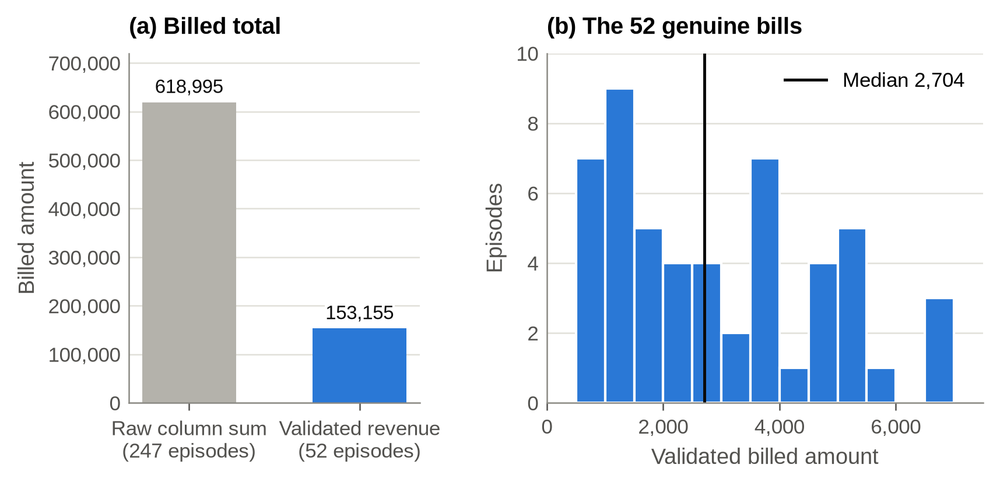

# 🏥 MediCare+ Hospital Analytics

### Data Quality · Statistical Analysis · KPI Engineering · Interactive Decision Support

<p align="center">
  
  
  
  
  
  
</p>

<p align="center">
  <strong>From raw hospital records to validated data, statistical evidence, and interactive decision support.</strong>
</p>

---

## 📌 Project Overview

**MediCare+ Hospital Analytics** is an end-to-end healthcare data analytics project built on a hospital admission register containing **247 admission episodes recorded during 2023**.

The project goes beyond conventional exploratory data analysis by combining:

* 🔎 **Data quality assessment**
* 🧹 **Data cleaning and validation**
* 📊 **KPI and metric engineering**
* 📈 **Exploratory data analysis**
* 🧪 **Statistical hypothesis testing**
* 💰 **Validated financial analysis**
* 🏥 **Clinical and operational analysis**
* 🖥️ **Interactive dashboard development**
* ⚡ **Optional real-time WebSocket streaming**
* 📑 **Reproducible reporting**

### Analytical Pipeline

```text
Raw Hospital Data
       ↓
Data Quality Audit
       ↓
Cleaning & Validation
       ↓
Derived Variables & KPIs
       ↓
Statistical Analysis
       ↓
Evidence-Based Insights
       ↓
Interactive Decision Dashboard
```

---

## 🎯 Project Objective

The objective is to transform a raw hospital admission register into a **reliable analytical asset** that can support clinical, operational, and financial interpretation.

The project specifically investigates:

> **What can be reliably concluded from the available hospital data after accounting for data-quality limitations?**

This distinction is essential because a recorded value is not necessarily an analytically valid value.

---

# 📊 Dataset at a Glance

| Indicator                  |          Value |
| -------------------------- | -------------: |
| 🏥 Admission episodes      |        **247** |
| 👥 Distinct patients       |         **75** |
| 👨‍⚕️ Attending physicians |          **7** |
| 🩺 Diagnoses               |         **10** |
| 🎂 Mean age                | **47.4 years** |
| 🔴 High-severity episodes  |      **36.0%** |
| 🛡️ Uninsured episodes     |      **29.1%** |
| ✅ Valid stays              |        **218** |
| ⏱️ Mean length of stay     |  **6.74 days** |
| 📍 Median length of stay   |     **4 days** |
| 💳 Genuine bills           |         **52** |
| 💰 Validated revenue       |    **153,155** |

---

# 🚨 Data Quality First

One of the strongest aspects of this project is that the analysis does **not** blindly aggregate the raw data.

## Billing quality

The original billing field contains recurring placeholder values:

* `999`
* `3,852`

These values occur in **195 of the 247 admission episodes**.

Therefore:

```text
Raw recorded billing       = 618,995
Validated billing          = 153,155
Genuine bills              = 52
Placeholder bills          = 195
```

The project consequently distinguishes between:

> **Recorded billing** ≠ **validated revenue**

Only validated bills are used for financial analysis.

---

## 📅 Admission / Discharge Validation

The dataset contains **29 episodes where the discharge date occurs before the admission date**.

These records are identified as date-quality errors and excluded from length-of-stay calculations.

```text
Total episodes             247
Invalid date sequences      29
Valid stays                218
```

For the 218 valid stays:

* **Mean length of stay:** 6.74 days
* **Median length of stay:** 4 days

Importantly, the original records are retained rather than silently deleted.

---

# 🧪 Statistical Analysis

The project uses statistical testing to distinguish **observed patterns** from relationships supported by statistical evidence.

### Tests performed

| Question                                 | Statistical method   |
| ---------------------------------------- | -------------------- |
| Length of stay across severity levels    | Kruskal–Wallis       |
| Validated billing across severity levels | Kruskal–Wallis       |
| Severity distribution by physician       | Chi-square           |
| Severity distribution by insurance       | Chi-square           |
| Monthly admission distribution           | Chi-square           |
| Length of stay vs. validated billing     | Spearman correlation |
| Genuine vs. placeholder billing groups   | Mann–Whitney U       |

---

# 🔍 Key Findings

### 01 · Billing data requires validation

**195 / 247 bills** are identified as placeholders.

The raw billing total is **618,995**, while validated revenue is **153,155** across **52 genuine bills**.

➡️ Financial KPIs must therefore be based on validated billing rather than the raw billing column.

---

### 02 · Invalid dates affect operational metrics

**29 admission episodes** contain impossible admission/discharge sequences.

After validation:

> **218 stays** remain suitable for length-of-stay analysis.

The resulting mean stay is **6.74 days**, with a median of **4 days**.

---

### 03 · Length of stay is positively associated with validated billing

For records with valid billing:

> **Spearman ρ = 0.62, p < 0.001**

The analysis therefore identifies a statistically significant positive association between length of stay and validated billing.

This is interpreted as an **association**, not proof of causation.

---

### 04 · Severity does not show a statistically significant relationship with length of stay

The Kruskal–Wallis test gives:

> **p = 0.84**

Within this dataset, there is insufficient statistical evidence of different length-of-stay distributions across severity groups.

---

### 05 · Severity does not show a statistically significant relationship with validated billing

For validated bills:

> **p = 0.28**

The dataset does not provide sufficient statistical evidence of differences in validated billing across severity groups.

---

### 06 · No statistically significant monthly seasonality

The monthly admission distribution gives:

> **p = 0.17**

At the conventional 5% significance level, the dataset does not provide sufficient evidence of significant monthly seasonality.

---

# 🖥️ Interactive Dashboard

The project includes a standalone **interactive HTML dashboard** designed to communicate the analytical results through a decision-oriented interface.

### Dashboard sections include

* 📊 Executive Overview
* 👥 Patient Analytics
* 🩺 Clinical Analysis
* 💰 Financial Analysis
* 🔎 Data Quality
* 💡 Statistical Insights
* 📈 KPI Monitoring
* ⚡ Optional real-time updates

### Dashboard Preview

<p align="center">
  
</p>

<p align="center">
  
</p>

<p align="center">
  
</p>

<p align="center">
  
</p>

---

# 📈 Analytical Visualizations

The repository contains **12 high-resolution analytical figures** covering:

* Data quality
* Revenue validation
* Case mix
* Validated revenue
* Monthly admissions
* Diagnosis by quarter
* Severity and insurance
* Physician analysis
* Age and length of stay
* Severity outcomes
* Correlation analysis
* Genuine billing by length of stay

Example:

<p align="center">
  
</p>

---

# ⚡ Real-Time WebSocket Layer

An optional WebSocket server can provide live KPI communication between the analytical backend and the dashboard.

```text
Hospital Dataset
      │
      ▼
Python Analytics Layer
      │
      ▼
WebSocket Server
      │
      ▼
Interactive Dashboard
      │
      ▼
Live KPI Updates
```

### Start the server

```bash
python websocket_server.py
```

The dashboard can then establish a local WebSocket connection.

The WebSocket layer is **optional**; the dashboard remains usable independently.

---

# 🧰 Technology Stack

### Data & Computing

<p>


</p>

### Analysis & Visualization

<p>


</p>

### Documentation & Reproducibility

<p>


</p>

---

# 📂 Repository Structure

```text
MediCare-Hospital-Analytics/
│
├── 📁 data/
│   ├── Hospital_Analytics_original.xlsx
│   ├── Hospital_Analytics_Clean.xlsx
│   ├── hospital_raw.csv
│   ├── hospital_clean.csv
│   ├── hospital_clean_en.csv
│   └── DATA_DICTIONARY.md
│
├── 📁 figures/
│   ├── 01_data_quality.png
│   ├── 02_revenue_gap.png
│   ├── 03_case_mix.png
│   ├── 04_validated_revenue.png
│   ├── 05_monthly_admissions.png
│   ├── 06_diagnosis_by_quarter.png
│   ├── 07_severity_insurance.png
│   ├── 08_physicians.png
│   ├── 09_age_los.png
│   ├── 10_severity_outcomes.png
│   ├── 11_correlations.png
│   ├── 12_genuine_bills_by_stay.png
│   └── 📁 dashboard_screenshoot/
│
├── 📁 results/
│   ├── kpis.csv
│   ├── data_quality_summary.csv
│   ├── correlations.csv
│   ├── statistical_tests.csv
│   ├── genuine_bills_by_stay.csv
│   ├── findings.json
│   └── aggregated analytical tables
│
├── 📓 MediCare-Hospital-Analytics.ipynb
├── 🖥️ dashboard.html
├── ⚡ websocket_server.py
├── 📄 WEBSOCKET.md
├── 📑 report.pdf
├── 📜 report.tex
├── 📋 requirements.txt
└── 📘 README.md
```

---

# ▶️ Reproducibility

## 1. Clone the repository

```bash
git clone https://github.com/koffifidelek59-collab/medicare-hospital-analytics.git
cd medicare-hospital-analytics
```

## 2. Install dependencies

```bash
pip install -r requirements.txt
```

## 3. Execute the analytical notebook

```bash
jupyter nbconvert --to notebook --execute --inplace MediCare-Hospital-Analytics.ipynb
```

## 4. Generate the report

```bash
pdflatex report.tex
pdflatex report.tex
```

## 5. Launch the optional WebSocket layer

```bash
python websocket_server.py
```

---

# 📦 Project Deliverables

| Deliverable                            | Description                            |
| -------------------------------------- | -------------------------------------- |
| 📓 `MediCare-Hospital-Analytics.ipynb` | Complete analytical workflow           |
| 🖥️ `dashboard.html`                   | Interactive decision-support dashboard |
| 📊 `data/`                             | Raw and validated datasets             |
| 📈 `figures/`                          | Analytical visualizations              |
| 📋 `results/`                          | KPI and statistical outputs            |
| 📖 `DATA_DICTIONARY.md`                | Data definitions and quality rules     |
| ⚡ `websocket_server.py`                | Optional real-time data layer          |
| 📄 `report.pdf`                        | Formal analytical report               |
| 📜 `report.tex`                        | LaTeX source                           |
| 📋 `requirements.txt`                  | Python dependencies                    |

---

# 🧠 Analytical Principles

This project follows five core principles:

**01 — Validate before aggregating**
Data quality must be assessed before producing KPIs.

**02 — Preserve traceability**
Problematic records are flagged rather than silently removed.

**03 — Separate observation from evidence**
Descriptive patterns are not automatically treated as statistically significant relationships.

**04 — Make assumptions explicit**
Derived metrics such as validated billing and length of stay are clearly defined.

**05 — Build for decision support**
The final objective is to convert data into interpretable evidence.

---

# ⚠️ Limitations

The results should be interpreted within the scope of the available dataset.

* The analysis covers **one calendar year: 2023**.
* The dataset contains **247 admission episodes**.
* Only **52 episodes have genuine billing values**.
* **29 episodes contain impossible date sequences**.
* Validated revenue therefore represents a **partial observed revenue base**, not necessarily total hospital revenue.
* Statistical associations do not establish causality.
* Findings from this register should not automatically be generalized to other hospitals or years.

---

# 🚀 Professional Skills Demonstrated

This project demonstrates practical capabilities in:

```text
Data Cleaning & Validation
        │
        ├── Missing / Invalid Data
        ├── Quality Flags
        └── Analytical Rules
                │
                ▼
Data Analysis
        │
        ├── KPI Engineering
        ├── EDA
        └── Segmentation
                │
                ▼
Statistical Analysis
        │
        ├── Hypothesis Testing
        ├── Correlation
        └── Distribution Analysis
                │
                ▼
Data Communication
        │
        ├── Visual Analytics
        ├── Dashboard Design
        └── Decision Support
```

---

# 👤 Author

### KOUAME Koffi Fidèle

**Energy Systems Analyst · Data Analyst · AI for Energy Systems · Green Hydrogen**

Master's Programme in **Energy and Green Hydrogen Technology — System Analysis**
WASCAL IMP-EGH · Abdou Moumouni University, Niger

Master 2 **Électronique, Électrotechnique, Automatique et Informatique**
Université Félix Houphouët-Boigny, Côte d'Ivoire

<p>
  <a href="https://www.linkedin.com/in/koffi-fidele-kouame/">
    
  </a>
  <a href="mailto:koffifidelek59@gmail.com">
    
  </a>
  <a href="https://github.com/koffifidelek59-collab">
    
  </a>
</p>

---

<p align="center">
  <strong>Turning raw data into reliable evidence and actionable insight.</strong>
</p>

<p align="center">
  ⭐ If you find this project useful, consider giving the repository a star.
</p>
